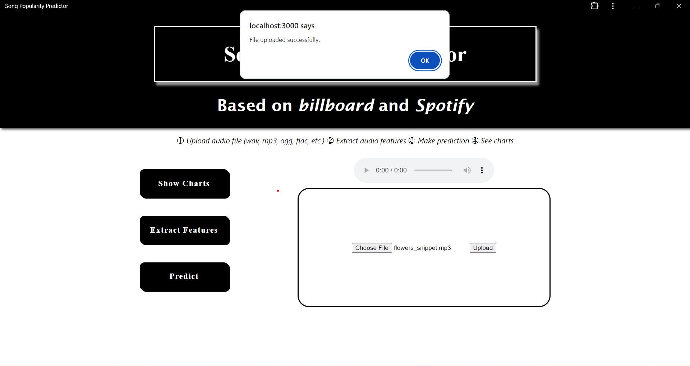
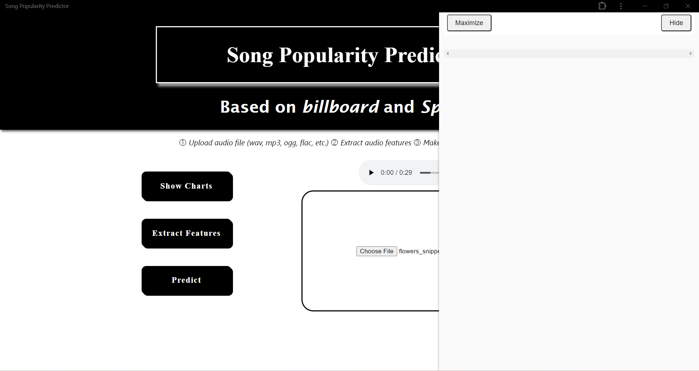
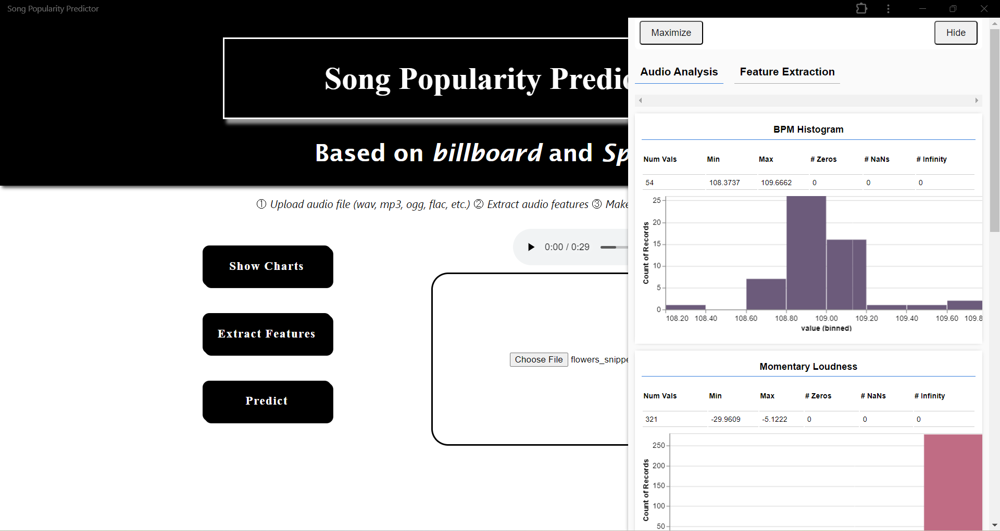
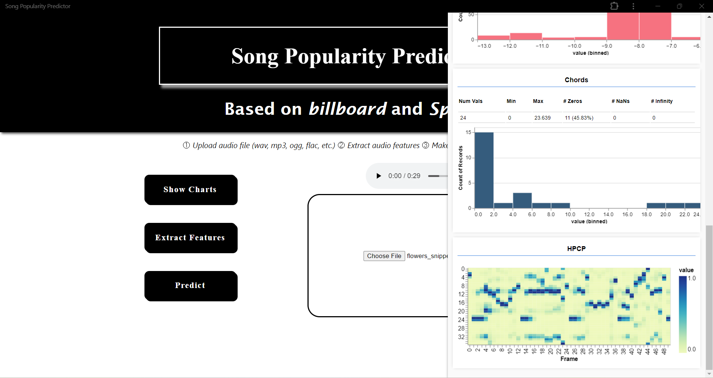
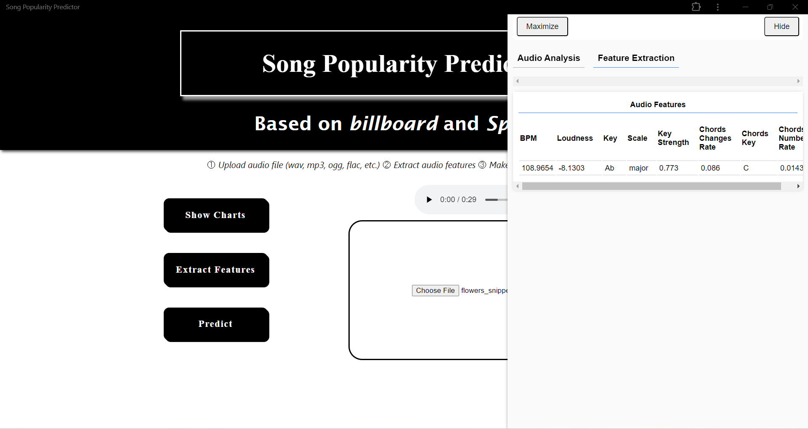
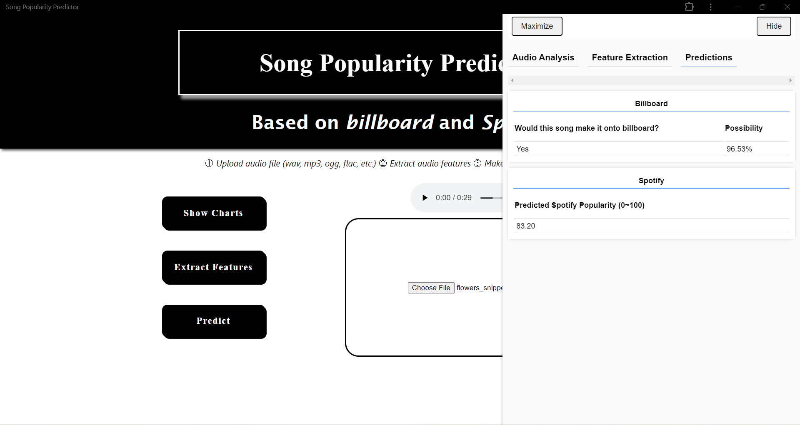

# Song Popularity Predictor  
*This is a learning project, the prediction results are indicative only and need further improvement.*  
For the data collection and model training process, see [ml](/ml) folder.
### 1. Upload a music audio file
     
### 2. Click *Show Charts* button to open data visualisation side panel to see feature extraction and model prediction process in action  
     
### 3. Click *Extract Features* button to
   a. Get visualised audio analysis results  
   
     
   b. Get extracted features used for prediction  
     
### 5. Click *Predict* button to predict whether this song can make it onto Billboard and its Spotify popularity score  
   
